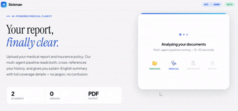
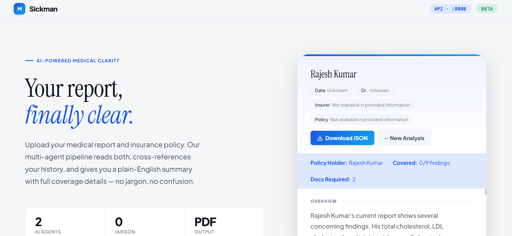
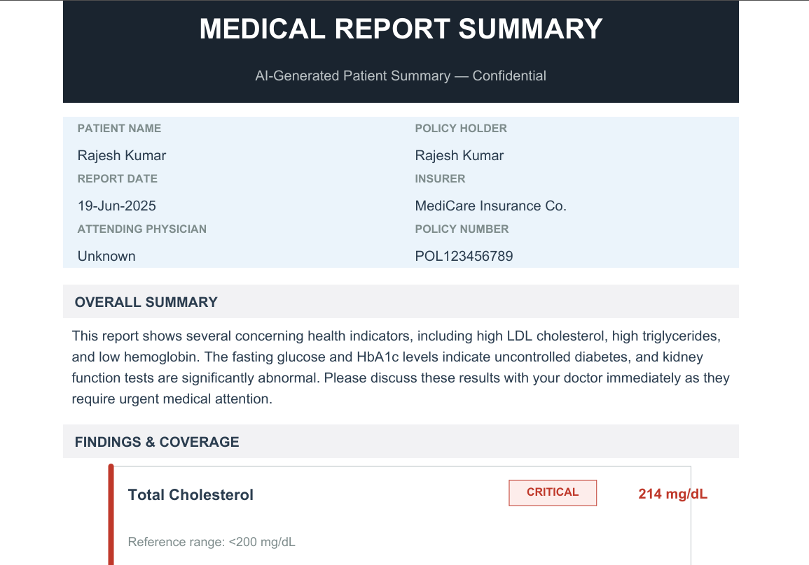

# 🏥 Medical Report Simplifier

An AI-powered multi-agent system that reads a patient's medical report, compares it against past history, cross-references their insurance policy, and generates a single plain-English PDF a patient can actually understand.

Built with LangGraph, Gemini, FAISS, OpenDataLoader, and FastAPI.

---

<!-- DEMO GIF — replace with your recording -->


---

## What It Does

Most patients receive medical reports full of clinical jargon, reference ranges, and lab codes they can't interpret. This system:

1. Parses the current report and past history PDFs (tables intact)
2. Retrieves relevant past findings from a local vector store
3. Flags each finding as 🔴 Critical / 🟡 Monitor / 🟢 Normal with a plain-English explanation
4. Shows trends against past results (↑ Higher than Dec 2024 result)
5. Cross-references the insurance policy and maps each finding to what's covered
6. Generates step-by-step claim instructions
7. Outputs everything as a clean, formatted PDF

---

## Architecture

```
Current Report PDF
       │
       ▼
┌─────────────────────────────────────────┐
│           LangGraph Orchestrator         │
│                                          │
│  ┌──────────────┐   ┌─────────────────┐ │
│  │ Medical Agent│──▶│ Insurance Agent │ │
│  │              │   │                 │ │
│  │ RAG: FAISS   │   │ RAG: FAISS      │ │
│  │ (medical)    │   │ (insurance)     │ │
│  └──────────────┘   └─────────────────┘ │
│              │               │           │
│              └───────┬───────┘           │
│                      ▼                   │
│            ┌──────────────────┐          │
│            │ Document Builder │          │
│            └──────────────────┘          │
└─────────────────────────────────────────┘
                      │
                      ▼
            final_report.pdf
```

### Agent Roles

| Agent | Input | Output |
|---|---|---|
| **Medical Agent** | Current report PDF + past history (FAISS) | `MedicalOutput` — findings, flags, trends, follow-up |
| **Insurance Agent** | `MedicalOutput` + policy PDF + policy index (FAISS) | `InsuranceOutput` — coverage, claim steps, docs required |
| **Document Builder** | Both outputs | Formatted PDF — no LLM calls, pure rendering |

---

## Tech Stack

| Layer | Technology |
|---|---|
| PDF Parsing | `langchain-opendataloader-pdf` |
| Vector Store | FAISS (local, CPU) |
| Embeddings | Gemini `text-embedding-004` |
| LLM | Gemini `gemini-2.0-flash` |
| Orchestration | LangGraph `StateGraph` |
| Structured Output | Pydantic v2 + `with_structured_output()` |
| PDF Rendering | ReportLab |
| API | FastAPI + Uvicorn |

---

## Project Structure

```
sickman/
├── api.py                      ← FastAPI app (run from here)
├── .env                        ← API keys (never committed)
├── .gitignore
├── README.md
│
├── core/
│   ├── __init__.py
│   ├── graph.py                ← LangGraph orchestrator
│   ├── ingest.py               ← PDF ingestion + FAISS indexing
│   └── agents/
│       ├── __init__.py
│       ├── medical_agent.py    ← Medical analysis agent
│       ├── insurance_agent.py  ← Insurance coverage agent
│       └── document_builder.py ← ReportLab PDF renderer
│
├── data/                       ← gitignored — never commit patient data
│   ├── medical/                ← past patient reports
│   └── insurance/              ← insurance policy PDFs
│
└── faiss_index/                ← gitignored — rebuild with ingest.py
    ├── medical_rag.faiss
    └── medical_rag.pkl
```

---

## Prerequisites

- Python 3.10+
- Java (required by OpenDataLoader)
  - **Windows:** download from https://www.java.com/en/download/
  - **Linux:** `sudo apt install default-jre`
  - **Mac:** `brew install java`
- A Gemini API key — get one free at https://aistudio.google.com

---

## Installation

**1. Clone the repo**
```bash
git clone https://github.com/arjunnain17/sickman.git
cd sickman
```

**2. Create and activate a virtual environment**
```bash
python -m venv venv

# Windows
venv\Scripts\activate

# Linux / Mac
source venv/bin/activate
```

**3. Install dependencies**
```bash
pip install -r requirements.txt
```

**4. Set up your API key**

Create a `.env` file in the project root:
```
GOOGLE_API_KEY=your_gemini_api_key_here
```

**5. Add your PDFs**
```
data/
├── medical/
│   ├── patient_report_jan2024.pdf
│   ├── patient_report_jun2024.pdf
│   └── ...                          ← past reports go here
└── insurance/
    └── policy.pdf                   ← one insurance policy PDF
```

**6. Run ingestion**
```bash
python -m core.ingest
```

You should see:
```
✓ Ingestion complete. Ready for agents.
```

Verify the chunk manifest at `faiss_index/chunk_manifest.json` — look for `"is_table": true` entries confirming tables were parsed correctly.

---

## Usage

### Option A — Command Line

Run the full pipeline directly:
```bash
python -m core.graph data/medical/current_report.pdf
```

Output:
- `final_report.pdf` — the patient-facing document
- `pipeline_state.json` — full debug state from all agents

### Option B — REST API

Start the server:
```bash
uvicorn api:app --reload --host 0.0.0.0 --port 8000
```

Open Swagger UI at **http://localhost:8000/docs**

<!-- SWAGGER SCREENSHOT — replace with your screenshot -->
 

#### Endpoints

| Method | Endpoint | Description |
|---|---|---|
| `GET` | `/health` | Liveness check |
| `POST` | `/ingest` | Trigger FAISS rebuild (background) |
| `POST` | `/ingest/upload` | Upload past PDFs + rebuild index |
| `POST` | `/analyze` | Run pipeline → JSON response |
| `POST` | `/analyze/download/json` | Run pipeline → download JSON file |
| `POST` | `/analyze/download/pdf` | Run pipeline → download PDF report |

#### Example — analyze via curl

```bash
curl -X POST http://localhost:8000/analyze/download/pdf \
  -F "report=@data/medical/current_report.pdf" \
  -F "policy=@data/insurance/policy.pdf" \
  --output final_report.pdf
```

---

## Sample Output

<!-- REPORT SCREENSHOT — replace with a screenshot of your generated PDF -->


Each finding renders as a card with:
- A coloured left stripe (🔴 red / 🟡 amber / 🟢 green)
- Plain-English explanation (no jargon)
- Trend compared to past history
- Insurance coverage status + pre-auth requirement
- Claim steps in numbered plain-language instructions

---

## How It Works — Step by Step

### 1. Ingestion (`core/ingest.py`)
PDFs are parsed with OpenDataLoader (`format="markdown"`) — lab tables become clean Markdown (`| Test | Value | Reference |`) instead of garbled text. Chunks are tagged with `source_type: medical` or `source_type: insurance` and embedded into a local FAISS index.

### 2. Medical Agent (`core/agents/medical_agent.py`)
Receives the current report PDF. Parses it, retrieves the top-6 most relevant past history chunks from FAISS (filtered to `source_type=medical`), and sends both to Gemini with a structured prompt. Returns a validated `MedicalOutput` Pydantic object — never free text.

Key output fields:
```
findings[].name              — test name
findings[].flag              — critical / monitor / normal
findings[].plain_explanation — 2 sentences, zero jargon
findings[].trend             — comparison to past results from RAG
follow_up_actions            — concrete next steps
referrals                    — specialist referrals
```

### 3. Insurance Agent (`core/agents/insurance_agent.py`)
Receives `MedicalOutput` from the Medical Agent. For each finding, it reasons:
> High Total Cholesterol → cardiovascular risk → is dyslipidemia covered?

Rather than searching for test names directly (which don't appear in policies), it maps findings to their underlying conditions and searches the policy for those. Returns `InsuranceOutput` with one `CoverageItem` per finding.

Key design: `CoverageItem.finding_name` is a foreign key back to `FindingItem.name` — this is how the Document Builder links findings to their coverage rows.

### 4. Document Builder (`core/agents/document_builder.py`)
Pure deterministic rendering — no LLM calls. Joins `MedicalOutput` and `InsuranceOutput` on `finding_name`, feeds the merged data into ReportLab. Uses Arial (Windows) or Helvetica as fallback for Unicode support (₹, ↑, ↓).

### 5. Orchestrator (`core/graph.py`)
LangGraph `StateGraph` that coordinates the pipeline. All agents read from and write to a shared `AgentState`. Sequential flow:
```
Medical Agent → Insurance Agent → Document Builder
```
If any agent fails, the error handler catches it cleanly and stops the pipeline.

---

## Configuration

All config is at the top of each file:

| File | Variable | Default | Description |
|---|---|---|---|
| `core/ingest.py` | `EMBEDDING_MODEL` | `models/text-embedding-004` | Gemini embedding model |
| `core/ingest.py` | `CHUNK_SIZE` | `512` | Tokens per chunk |
| `core/ingest.py` | `CHUNK_OVERLAP` | `100` | Overlap between chunks |
| `core/agents/medical_agent.py` | `LLM_MODEL` | `gemini-2.0-flash` | LLM for analysis |
| `core/agents/medical_agent.py` | `EMBEDDING_MODEL` | `models/text-embedding-004` | Must match ingest |
| `core/agents/insurance_agent.py` | `LLM_MODEL` | `gemini-2.5-flash-lite` | LLM for coverage analysis |

> ⚠️ `EMBEDDING_MODEL` must be identical in `ingest.py` and both agents. If they differ, query vectors won't align with the index and retrieval will fail silently.

---

## Troubleshooting

**`can not locate xref table`**
Your policy PDF is corrupted. Re-save it:
Open in Chrome → Ctrl+P → Save as PDF → overwrite the file.

**`UnicodeEncodeError` (₹ or arrow symbols)**
Set the environment variable before running:
```powershell
$env:PYTHONIOENCODING = "utf-8"
```
Or set it permanently:
```powershell
[System.Environment]::SetEnvironmentVariable("PYTHONIOENCODING", "utf-8", "User")
```

**`models/text-embedding-001 is not found`**
Wrong model name in one of the files. Make sure all files use:
```python
EMBEDDING_MODEL = "models/text-embedding-004"
```

**Elements overflowing in PDF**
Column widths exceed content area. All widths must sum to `CONTENT_WIDTH = A4[0] - 40mm = 170mm`. Card inner width is `146mm` (170 - 24mm padding). Coverage box inner is `130mm`.

**`InsuranceOutput object is not subscriptable`**
Pydantic objects use dot notation, not dict syntax. Use `coverage.covered` not `coverage["covered"]`.

**Insurance agent returns all ❌**
The agent is searching for test names in the policy instead of conditions. Update the prompt to map findings to their underlying conditions (e.g. High Cholesterol → dyslipidemia → cardiovascular coverage).

---

## Privacy & Data

- All processing is local — PDFs never leave your machine
- `data/` and `faiss_index/` are gitignored — patient data is never committed
- The FAISS index is a derived artifact — rebuild it with `python -m core.ingest` after adding new PDFs
- For production use, add authentication to the FastAPI endpoints

---

## Roadmap

- [ ] Frontend web UI for PDF upload
- [ ] Multi-patient support with patient ID namespacing
- [ ] Support for scanned PDFs via OpenDataLoader hybrid OCR mode
- [ ] DOCX output format option
- [ ] Hindi / regional language output support
- [ ] Email delivery of the final report

---

## Contributing

1. Fork the repo
2. Create a feature branch: `git checkout -b feature/your-feature`
3. Commit your changes: `git commit -m 'Add your feature'`
4. Push to the branch: `git push origin feature/your-feature`
5. Open a Pull Request

---

## License

MIT License — see `LICENSE` for details.

---

## Acknowledgements

- [OpenDataLoader](https://opendataloader.org) — PDF parsing engine
- [LangChain](https://langchain.com) — agent framework
- [LangGraph](https://langchain-ai.github.io/langgraph/) — multi-agent orchestration
- [Google Gemini](https://ai.google.dev) — LLM and embeddings
- [ReportLab](https://www.reportlab.com) — PDF rendering

---

*Built as a portfolio project targeting Indian and North American SME healthcare workflows.*